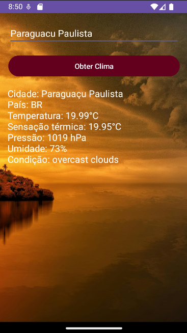

# App de Clima - Busca por Cidade

Mantenha-se informado sobre o clima da sua cidade com o App de Clima. Com uma interface elegante e fácil de usar, você pode obter informações detalhadas sobre as condições meteorológicas atuais em apenas alguns toques.

## Funcionalidades:

- **Busca por Cidade**: Digite o nome da cidade desejada e obtenha instantaneamente as condições climáticas.
- **Informações Detalhadas**:
  - **Cidade e País**: Identificação clara do local para evitar confusões.
  - **Temperatura Atual**: Saiba a temperatura exata do momento.
  - **Sensação Térmica**: Informação sobre como a temperatura realmente é percebida.
  - **Pressão Atmosférica**: Dados sobre a pressão para os entusiastas do clima.
  - **Umidade**: Níveis de umidade para ajudar no planejamento do seu dia.
  - **Condições Climáticas**: Descrição clara do estado do céu (nublado, ensolarado, etc.).

## Exemplo de Uso

